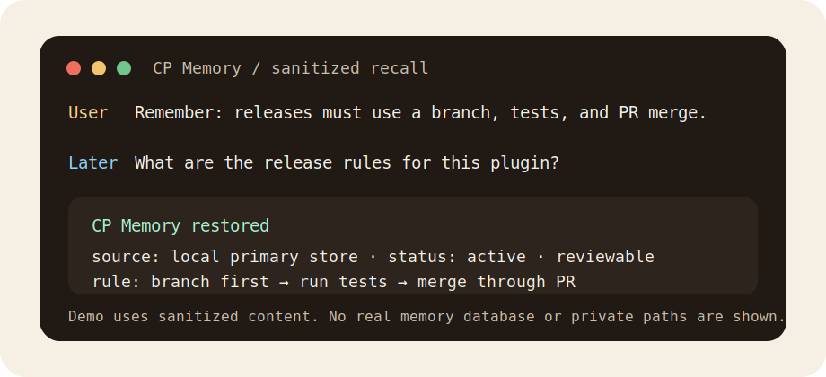

<p align="center">
  
</p>

<h1 align="center">CP Memory</h1>

<p align="center">
  A local-first, reviewable memory layer for Codex: remember useful context, explain why, and correct bad memory safely.
</p>

<p align="center">
  <a href="README.md">中文</a> | English
</p>

<p align="center">
  <a href="LICENSE"></a>
  
  
</p>

---

CP Memory is a local memory plugin for Codex. It stores facts, preferences, ongoing work, episodes, decisions, and conversation checkpoints in a local SQLite database, then restores relevant context through MCP tools and lifecycle hooks.

The goal is not to remember as much as possible. The goal is memory that remains trustworthy after long-term use: explainable, reviewable, correctable, and governable.



## Why Use It

- Local-first: data is stored under `~/.cp-memory/memory.db` by default.
- Codex-native: supports plugin metadata, MCP server, skills, and lifecycle hooks.
- Long-term personal memory: supports profiles, preferences, relationships, ongoing work, episodes, and stable decisions.
- Governable: includes conflict detection, correction history, review queues, and governance reports.
- Conservative extraction: extracts long-term memory only from explicit signals to reduce noisy or incorrect memory.

## 30-Second Example

You tell Codex:

```text
Remember this: releases for this project must start on a branch, run tests, and merge through a PR.
```

In a later session, you ask:

```text
What are the release rules for this plugin?
```

CP Memory restores the relevant memory from the local primary store first, and Codex follows that rule. If the memory is wrong, you can mark it wrong, mark it stale, or write a corrected version.

See more anonymized examples in [docs/examples.md](docs/examples.md).

## Install

The recommended path is GitHub marketplace installation:

```powershell
codex plugin marketplace add CJhuochai/cp-memory
codex plugin add cp-memory@cp-memory
```

Restart Codex after installation. If Codex asks you to trust hooks, approve the CP Memory lifecycle hooks in the hooks view.

## Safety

- Do not commit your real `memory.db`, logs, private summaries, or environment files.
- Automatic extraction is intentionally conservative. Generated memories can be reviewed, corrected, marked stale, or marked wrong.
- Examples and screenshots use sanitized content, so you do not need to expose your real memory database.

## Comparison

If you have seen other memory projects, start with [docs/comparison.md](docs/comparison.md). CP Memory's main difference is Codex lifecycle integration plus memory governance, not just storage and search.

## Roadmap

See [docs/roadmap.md](docs/roadmap.md) for future directions. The roadmap prioritizes local-first behavior, explainability, correctability, and privacy safety.

## Local Development

Regular users do not need to run `install.ps1`. It is mainly for local development, refreshing the personal marketplace cache, and migrating old global hook wiring from earlier versions.

Run the test suite:

```powershell
python -m unittest discover -s tests -p test_cp_memory.py
```

Validate the installer in an isolated temporary profile without touching your real Codex configuration:

```powershell
powershell -ExecutionPolicy Bypass -File .\scripts\test-install.ps1
```

## License

MIT
