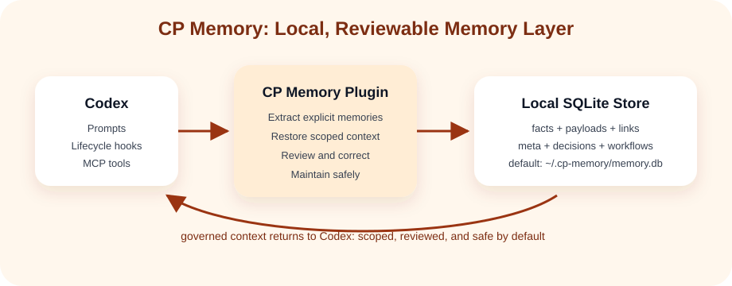
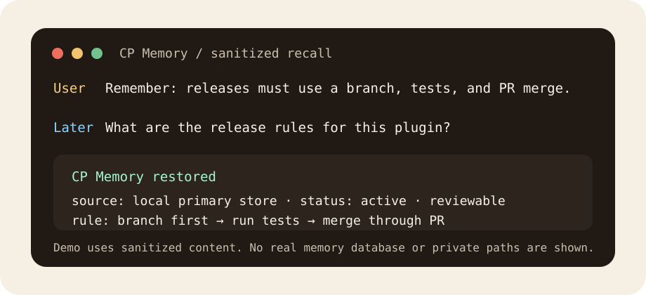
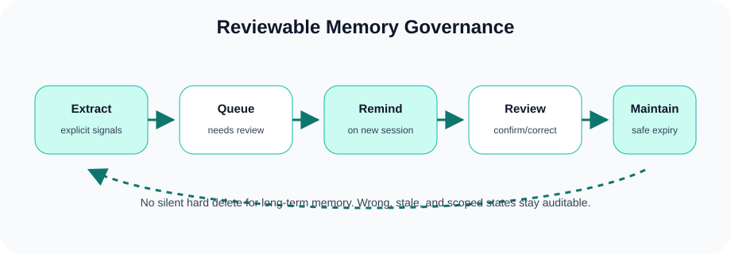

<p align="center">
  
</p>

<h1 align="center">CP Memory</h1>

<p align="center">
  Codex 的本地优先、可审阅记忆层：记住重要上下文，解释为什么记住，并允许安全纠错。
</p>

<p align="center">
  中文 | <a href="README.en.md">English</a>
</p>

<p align="center">
  <a href="LICENSE"></a>
  
  
  
</p>

---

CP Memory 是一个面向 Codex 的本地优先记忆插件。它把事实、偏好、持续事项、事件、决策和会话检查点保存到本地 SQLite 数据库，再通过 MCP 工具和生命周期 hooks 在合适的时机恢复上下文。

它的重点不是“尽可能多地记住”，而是“长期使用后仍然可信”：可解释、可审阅、可纠错、可治理。





## 为什么用它

- 本地优先：默认数据保存在 `~/.cp-memory/memory.db`。
- Codex 原生：同时支持 plugin manifest、MCP server、skills 和 lifecycle hooks。
- 长期个人记忆：支持画像、偏好、关系、持续事项、事件和稳定决策。
- 可治理：支持冲突检测、纠错历史、复核队列和治理报告。
- 保守提炼：只从明确表达中提炼长期记忆，降低“乱记”和上下文污染。

## 当前能力

- 恢复上下文：启动和提问时按需恢复本地主库里的相关记忆。
- 自动提炼：从明确表达中保守生成个人长期记忆候选。
- 项目范围：按 `repo:`、`project:`、`workspace:` 等 scope 优先恢复当前项目相关记忆。
- 可审阅治理：支持审阅 Inbox、审阅报告、冲突建议、纠错状态和启动提醒。
- 安全维护：每周维护只做健康检查、治理预检和低风险过期清理。



## 30 秒例子

你告诉 Codex：

```text
记住一下：这个项目的发布流程必须先开分支、跑测试、再通过 PR 合并。
```

之后的新会话里，你可以问：

```text
我们这个插件的发布规则是什么？
```

CP Memory 会优先从本地主库恢复相关记忆，并让 Codex 按这条规则工作。如果记错了，你可以把那条记忆标记为错误、过期，或写入新的纠正版本。

更多匿名化示例见 [docs/examples.md](docs/examples.md)。

## 安装

Windows 推荐通过 GitHub Marketplace 安装：

```powershell
codex plugin marketplace add CJhuochai/cp-memory
codex plugin add cp-memory@cp-memory
```

安装后重启 Codex。如果 Codex 提示信任 hooks，请在 hooks 页面确认 CP Memory 的生命周期 hooks。

macOS/Linux 请使用源码安装器；它会创建插件私有 Python 运行环境并安装 MCP 依赖：

```sh
git clone https://github.com/CJhuochai/cp-memory.git
cd cp-memory
sh ./install.sh
```

完成后重启 Codex。不要把 macOS/Linux 的 GitHub Marketplace 安装当作已验证的等价路径：Marketplace 不会自动运行 `install.sh`，因而不会创建该私有运行环境。

## 平台支持

| 平台 | 推荐安装路径 | 已验证范围 |
| --- | --- | --- |
| Windows | GitHub Marketplace；本地开发可用 `install.ps1` | 单元测试、隔离安装验证和 GitHub Actions CI 均通过 |
| macOS | 源码安装器 `sh ./install.sh` | GitHub Actions macOS CI：单元测试与隔离安装/MCP 启动验证通过 |
| Linux | 源码安装器 `sh ./install.sh` | GitHub Actions Ubuntu CI：单元测试与隔离安装/MCP 启动验证通过 |

macOS/Linux 的真实 Codex 桌面端 Hook 注入尚未在实体设备上手工冒烟；当前发布依据是三端 CI。这个边界不影响已覆盖的安装器和 MCP 启动验证，但不应被表述为完整桌面端手工验收。

## 安全边界

- 不要提交真实 `memory.db`、日志、私人摘要或环境文件。
- 自动提炼默认保守，生成的记忆可以审阅、纠正、标记过期或标记错误。
- 新会话会在发现待审阅记忆时提示用户，但不会自动删除或自动解决冲突。
- 每周维护只做健康检查、治理预检和低风险过期清理；长期个人记忆、任务和决策默认受保护。
- 示例和截图均使用脱敏内容，不需要暴露真实记忆库。

## 对比

如果你已经看过其他 memory 项目，可以直接看 [docs/comparison.md](docs/comparison.md)。CP Memory 的主要差异是：Codex 生命周期集成 + 记忆治理，而不是只做存储和搜索。

## 路线图

后续方向见 [docs/roadmap.md](docs/roadmap.md)。路线图会优先保持本地优先、可解释、可纠错和隐私安全。

版本变化见 [CHANGELOG.md](CHANGELOG.md)。

## 本地开发

Windows 普通用户通常不需要运行 `install.ps1`。它主要用于本地开发、刷新 personal marketplace 缓存，以及迁移旧版本留下的全局 hook 接线。

macOS/Linux 本地开发可运行：

```sh
sh ./install.sh
sh ./scripts/test-install.sh
```

需要 Python 3，并确保 `python3` 在 PATH 中。安装器会在插件目录创建私有虚拟环境并安装运行依赖；这是 macOS/Linux 当前已验证的安装路径。

运行测试：

```powershell
python -m unittest discover -s tests -p test_cp_memory.py
```

隔离验证安装脚本，不会触碰真实 Codex 配置：

```powershell
powershell -ExecutionPolicy Bypass -File .\scripts\test-install.ps1
```

## License

MIT
