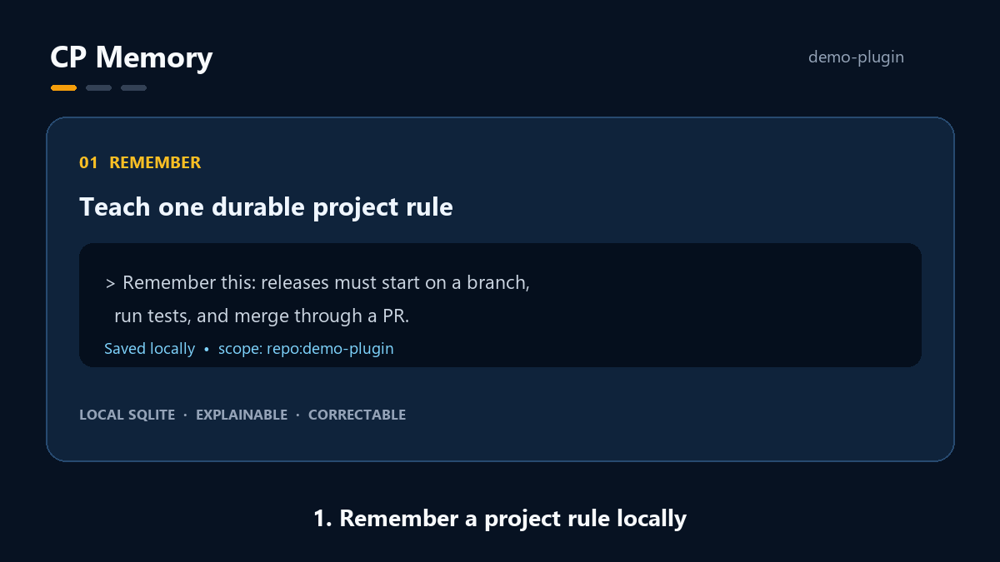

# CP Memory 30-Second Demo Script

## 中文

本脚本用于录制 GIF、短视频或产品介绍。所有内容必须使用虚构、脱敏的项目和规则；不要录制真实 `memory.db`、本地路径、账户信息、客户信息或完整私人会话。



### 场景 1：记录规则（0–8 秒）

画面：一个名为 `demo-plugin` 的虚构项目中的 Codex 会话。

输入：

```text
记住一下：这个项目发布前必须先开分支、跑测试、再通过 PR 合并。
```

旁白/字幕：`1. 在本地记住一条项目规则。`

### 场景 2：跨会话恢复（8–20 秒）

画面：开启一个新的、同样属于 `demo-plugin` 的会话。

输入：

```text
帮我更新发布文档。
```

展示：Codex 先说明已恢复发布规则，然后建议从分支开始，而不是直接修改 `main`。

旁白/字幕：`2. 在后续会话中恢复它。`

### 场景 3：安全纠错（20–30 秒）

画面：展示一条虚构的旧记忆“发布文档只需要中文”，再展示其被标记为 `wrong`，以及新的双语规则。

旁白/字幕：`3. 纠正错误记忆，同时保留历史。`

### 录制前检查

- 使用新的演示 profile 或虚构数据。
- 不展示本地目录、用户名、仓库私密地址、token 或日志。
- 不把当前隐藏的审阅提醒剪辑为用户界面功能。
- 录制完成后逐帧检查截图、终端和聊天内容是否包含私人数据。

## English

Use this script for a GIF, short video, or product introduction. All projects and rules must be fictional and sanitized. Do not record a real `memory.db`, local paths, account information, customer information, or private full conversations.


### Scene 1: Record a rule (0–8 seconds)

Screen: A Codex session in a fictional project named `demo-plugin`.

Input:

```text
Remember this: before releasing this project, create a branch, run tests, and merge through a PR.
```

Voiceover/caption: `1. Remember a project rule locally.`

### Scene 2: Restore across sessions (8–20 seconds)

Screen: Start a new session for the same fictional `demo-plugin` project.

Input:

```text
Help me update the release documentation.
```

Show: Codex explains that it restored the release rule and proposes starting from a branch rather than editing `main` directly.

Voiceover/caption: `2. Recall it in a later session.`

### Scene 3: Correct safely (20–30 seconds)

Screen: Show a fictional old memory, “Release docs only need Chinese,” marked `wrong`, followed by the new bilingual rule.

Voiceover/caption: `3. Correct bad memory without hiding history.`

### Pre-recording checklist

- Use a fresh demo profile or fictional data.
- Do not show local directories, usernames, private repository URLs, tokens, or logs.
- Do not edit the current hidden review reminder to look like a user-interface feature.
- Review every frame, terminal output, and chat message for private data before publishing.
